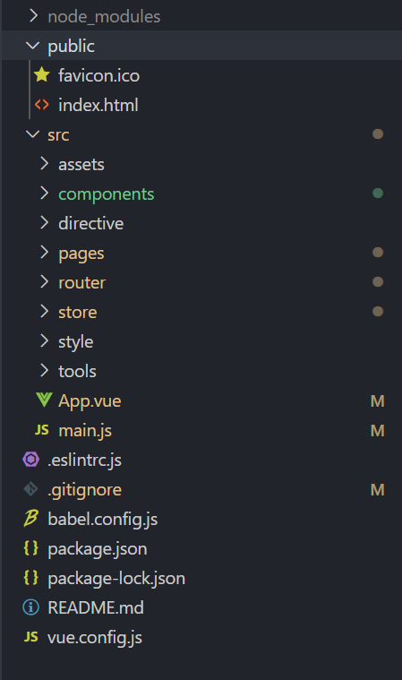
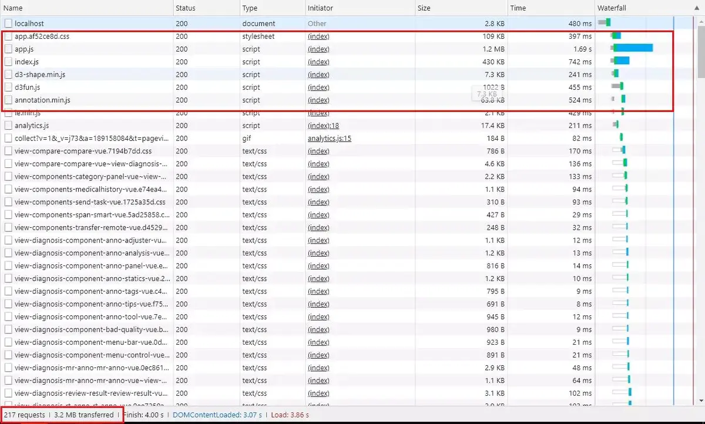

总结一下vue-cli@3.0脚手架的使用及其配置.

# 一、安装
1. 下载安装node,登录[node官网](https://nodejs.org/en/download/),选中合适的node版本进行安装;
2. 安装vue-cli脚手架工具

```bash
    npm install @vue/cli -g
```

# 二、创建一个项目
```bash
    vue create my-project
    # or
    vue ui  
```
1. 选择合适的配置

```bash
    # 版本信息
    VUE CLI v4.4.1
    ? Please pick a preset: (Use arrow keys)
    > default (babel, eslint)
    Manually select features 
```

2. 选择需要的插件及编译工具

```bash
    ? Please pick a preset: Manually select features
    ? Check the features needed for your project: (Press <space> to select, <a> to toggle all, <i> to invert selection)
    >(*) Babel
     ( ) TypeScript
     ( ) Progressive Web App (PWA) Support
     (*) Router
     ( ) Vuex
     (*) CSS Pre-processors
     (*) Linter / Formatter
     ( ) Unit Testing
     ( ) E2E Testing 
```

3. 接下来的一些配置选项

```bash
    ? Please pick a preset: Manually select features
    ? Check the features needed for your project: Babel, Router, CSS Pre-processors, Linter
    # 路由是否选择 history模式
    ? Use history mode for router? (Requires proper server setup for index fallback in production) Yes
    # 选择 CSS预处理类型
    ? Pick a CSS pre-processor (PostCSS, Autoprefixer and CSS Modules are supported by default): Sass/SCSS (with node-sass)
    # 选择 eslint校验风格
    ? Pick a linter / formatter config: Airbnb
    # 什么时候进行eslint校验
    ? Pick additional lint features: Lint on save
    # 选择Babel,PostCSS, ESLint等自定义配置的存放位置
    ? Where do you prefer placing config for Babel, ESLint, etc.? In dedicated config files
    # 是否保存当前选择的配置项
    ? Save this as a preset for future projects? (y/N)   
```

4. 最后进入项目,下载依赖,启动项目

```bash
    cd my-project
    npm install
    npm run serve
```

# 三、目录结构


# 四、环境变量配置
环境变量说明

```bash
    .env                # 在所有环境中被载入
    .env.local          # 在所有环境中被载入，被git忽略
    .env.[mode]         # 在指定的模式（development|production）种被载入
    .env.[mode].local   # 在指定的模式中载入，被git忽略
```

1.新建环境变量 .env.development.test 用于测试环境

并添加如下代码
```
    NODE_ENV='development'
    VUE_APP_URL='测试环境域名'
```

> 只有以VUE_APP_开头的变量会被webpack.DefinePlugin静态嵌入待客户端的包中，可以在应用通过如下代码访问该变量
```javascript
    console.log(process.env.VUE_APP_URL)
```

2.修改package.json，并在scripts里添加如下代码
```javascript
    "serve:test": "vue-cli-service serve --mode development.test"
```

3.如果项目中有使用到公共环境变量，为了避免在每个.env文件中配置，也可以在vue.config.js中进行配置
在设置之前先看下2.0时代的环境变量配置，之前在prod.env.js中会做如下配置
```javascript
    'use strict'
    module.exports = {
        NODE_ENV: 'production'
    }
```

3.0我们不能做这样的配置，我们只能通过vue.config.js来进行配置，添加如下代码，进行公共环境变量配置
```javascript
    //vue.config.js
    module.eports = {
        chainWebpack: config => {
            //添加环境变量
            config.plugin('define')
                .tap(args => {
                    args[0]["provess.env].VUE_APP_ENVBANE = JSON.stringify("环境变量值");
                    return args;
                })
        }
    }
```

# 五、添加配置文件 vue.config.js
vue.config.js是一个可选的配置文件，如果项目根目录中存在这个文件，它会被@vue/cli-service自动加载。你也可以使用package.json中的vue字段，注意严格按照JSON的格式来写。
```javascript
    //vue.config.js
    module.exports = {
        // baseUrl从 Vue CLI 3.3 起已弃用，请使用publicPath。
        // baseUrl:'./', 
        // 配置sub-path后访问路径为https://xxx-path/sub-path/#/
        publicPath: process.env.NODE_ENV === 'production' ? '/sub-path/' : '/',
        // 输出文件路径，默认为dist
        outputDir: 'dist',  
        // 放置生成的静态资源 (js、css、img、fonts) 的 (相对于 outputDir 的) 目录。
        assetsDir: '', 
        // 指定生成的 index.html 的输出路径 (相对于 outputDir)。也可以是一个绝对路径
        indexPath: '',
        // 配置多页应用
        pages: {
            index: {
                // page 的入口
                entry: 'src/index/main.js',
                // 模板来源
                template: 'public/index.html',
                // 在 dist/index.html 的输出
                filename: 'index.html',
                // 当使用 title 选项时，
                // template 中的 title 标签需要是 <title><%= htmlWebpackPlugin.options.title %></title>
                title: 'Index Page',
                // 在这个页面中包含的块，默认情况下会包含
                // 提取出来的通用 chunk 和 vendor chunk。
                chunks: ['chunk-vendors', 'chunk-common', 'index']
            },
            // 当使用只有入口的字符串格式时，
            // 模板会被推导为 `public/subpage.html`
            // 并且如果找不到的话，就回退到 `public/index.html`。
            // 输出文件名会被推导为 `subpage.html`。
            subpage: 'src/subpage/main.js',
        },
        lintOnSave: true,  // 保存时 lint 代码
        // css相关配置
        css: {
            // 是否使用css分离插件 ExtractTextPlugin
            extract: true,
            // 开启 CSS source maps?
            sourceMap: false,
            // css预设器配置项
            loaderOptions: {
                // pass options to sass-loader
                sass: {
                    // 自动注入全局变量样式
                    data: `
                        @import "src/你的全局scss文件路径";
                    `
                }
            },
            // 启用 CSS modules for all css / pre-processor files.
            modules: false,
        },
        // 生产环境是否生成 sourceMap 文件
        productionSourceMap: false,
        //是否为 Babel 或 TypeScript 使用 thread-loader。该选项在系统的 CPU 有多于一个内核时自动启用，仅作用于生产构建。
        parallel: require('os').cpus().length > 1,
        // 所有 webpack-dev-server 的选项都支持
        devServer: {
            port: 8080, // 配置端口
            open: true, // 自动开启浏览器
            compress: true, // 开启压缩
            // 设置让浏览器 overlay 同时显示警告和错误
            overlay: {
                warnings: true,
                errors: true
            },
            // 设置请求代理
            proxy: {
                '/api': {
                    target: '<url>',
                    ws: true,
                    changeOrigin: true
                },
                '/foo': {
                    target: '<other_url>'
                }
            }
        },
    }
```

# 六、修改webpack配置信息
**vue-cli3.0** 的版本已经将 **webpack** 的配置整合到 **vue.config.js** 中

```javascript
    // 安装 babel-polyfill
    // npm install babel-polyfill 或者 yarn add babel-polyfill
    // 安装 uglifyjs-webpack-plugin
    // npm install uglifyjs-webpack-plugin -D 或者 yarn add uglifyjs-webpack-plugin -D

    // vue.config.js
    const UglifyJsPlugin = require('uglifyjs-webpack-plugin');
    const isProduction = process.env.NODE_ENV === 'production';

    module.exports = {
        chainWebpack: config => {
            // 引入babel-polyfill
            config
                .entry('index')
                .add('babel-polyfill')
                .end();
            // 添加文件路径别名
            config.resolve.alias.set("@", resolve("src"));
            if (isProduction) {
                // 生产环境注入cdn
                config.plugin('html')
                    .tap(args => {
                        args[0].cdn = cdn;
                        return args;
                    });
            }
        },
        configureWebpack: config => {
            if (isProduction) {
                // 为生产环境修改配置...
                config.plugins.push(
                    //添加代码压缩工具，及设置生产环境自动删除console
                    new UglifyJsPlugin({
                        uglifyOptions: {
                            compress: {
                                warnings: false,
                                drop_debugger: true,
                                drop_console: true,
                            },
                        },
                        sourceMap: false,
                        parallel: true,
                    })
                );
            } else {
                // 为开发环境修改配置...
            }
        },
    }
```

分离第三方插件，引入cdn配置
```javascript
    // vue.config.js
    const isProduction = process.env.NODE_ENV === 'production';
    const cdn = {
        css: [],
        js: [
            'https://xxx-cdn-path/vue.runtime.min.js',
            'https://xxx-cdn-path/vue-router.min.js',
            'https://xxx-cdn-path/vuex.min.js',
            'https://xxx-cdn-path/axios.min.js',
        ]
    }

    module.exports = {
        configureWebpack: config => {
            if (isProduction) {
                // 用cdn方式引入,分离第三方插件
                config.externals = {
                    'vue': 'Vue',
                    'vuex': 'Vuex',
                    'vue-router': 'VueRouter',
                    'axios': 'axios'
                }
            } else {
                // 为开发环境修改配置...
            }
        },
    }
```

修改html文件
```html
    <!DOCTYPE html>
    <html lang="zh">

    <head>
    <meta charset="utf-8">
    <meta http-equiv="X-UA-Compatible" content="IE=edge">
    <meta name="viewport" content="width=device-width,initial-scale=1.0">
    <link rel="icon" href="<%= BASE_URL %>static/favicon.ico" type="image/x-icon" />
    <link rel="shortcut icon" href="<%= BASE_URL %>static/favicon.ico" type="image/x-icon" />
    <title>my-project</title>
    <!-- 使用CDN的CSS文件 -->
    <% for (var i in htmlWebpackPlugin.options.cdn && htmlWebpackPlugin.options.cdn.css) { %>
        <link href="<%= htmlWebpackPlugin.options.cdn.css[i] %>" rel="preload" as="style">
        <link href="<%= htmlWebpackPlugin.options.cdn.css[i] %>" rel="stylesheet">
    <% } %>
    <!-- 使用CDN的JS文件 -->
    <% for (var i in htmlWebpackPlugin.options.cdn && htmlWebpackPlugin.options.cdn.js) { %>
        <link href="<%= htmlWebpackPlugin.options.cdn.js[i] %>" rel="preload" as="script">
    <% } %>
    </head>

    <body>
        <noscript>
            <strong>We're sorry but eye-admin doesn't work properly without JavaScript enabled. Please enable it to continue.</strong>
        </noscript>
        <div id="app"></div>
        <!-- built files will be auto injected -->
        <% for (var i in htmlWebpackPlugin.options.cdn && htmlWebpackPlugin.options.cdn.js) { %>
            <script src="<%= htmlWebpackPlugin.options.cdn.js[i] %>"></script>
        <% } %>
    </body>

    </html>
```

# 七 关于打包后请求数量的有坏蛋Preload and Prefetch
首先看一张图


从图中可以看到首次加载的资源非常多，有很多个请求，??????
查看[官方文档](https://cli.vuejs.org/zh/guide/html-and-static-assets.html#%E6%8F%92%E5%80%BC)，可以得知：
```html
    <link rel="preload"> 是一种 resource hint，用来指定页面加载后很快会被用到的资源，所以在页面加载的过程中，我们希望在浏览器开始主体渲染之前尽早 preload。

    默认情况下，一个 Vue CLI 应用会为所有初始化渲染需要的文件自动生成 preload 提示。

    这些提示会被 @vue/preload-webpack-plugin 注入，并且可以通过 chainWebpack 的 config.plugin('preload') 进行修改和删除
```
```html
    <link rel="prefetch"> 是一种 resource hint，用来告诉浏览器在页面加载完成后，利用空闲时间提前获取用户未来可能会访问的内容。

    默认情况下，一个 Vue CLI 应用会为所有作为 async chunk 生成的 JavaScript 文件 (通过动态 import() 按需 code splitting 的产物) 自动生成 prefetch 提示。

    这些提示会被 @vue/preload-webpack-plugin 注入，并且可以通过 chainWebpack 的 config.plugin('prefetch') 进行修改和删除。
```

所以修改**vue.config.js**文件
```javascript
    // vue.config.js
    module.exports = {
        chainWebpack: config => {
            // 移除 prefetch 插件
            config.plugins.delete('preload');
            config.plugins.delete('prefetch');
        }
    }
```

# 八 总结
vue-cli3在项目配置上精简了很多，而且它也提供了很多配置选项，满足定制化需要。各种配置也特别贴心，可以按照自己项目的需要进行自定义修改，大大减少了提升了开发的工作效率

文章转载至[https://www.jianshu.com/p/9d7a09a4a474](https://www.jianshu.com/p/9d7a09a4a474)，侵删。